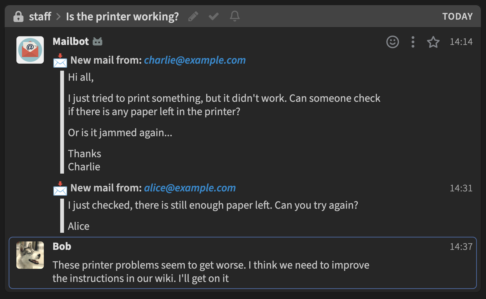

# Zulip mail mirror bot

A bot that queries new mails from an IMAP server and mirrors them to a [Zulip](https://zulip.com/) server.
We used it back in the days at TU Darmstadt's Computer Engineering student council and it includes some customizations for that use case.

We used the bot to mirror incoming mails from mailing lists to be able to discuss them and coordinate actions/responses. For example:



This bot is based on Zulip's built-in mail handling code, but it has a couple of advantages:


- Can strip prefixes such as "Re:" or "Fwd:" from the mail's subject. This is customizable to also include German equivalents
- Filter additional mail footers based on keywords
- Can also handle older mails by directly connecting to a mailbox via IMAP
- Can optionally delete all processed mails via IMAP

## Setup

[Create a Zulip bot.](https://zulip.com/api/running-bots)

Adjust the config file `bot_config.py` to your needs and insert the zulip config file `zuliprc`.

```bash
python -m venv env
source env/bin/activate
pip install -r requirements.txt
./mail-mirror.py
```

For continued usage you can use the systemd-service file in `systemd/` as a starting point.

Adjust the paths and place the unit in, e.g., `/etc/systemd/system/`. Then run `systemctl start zulip-bot-mail-mirror`. You can view the logs using `journalctl -f -u zulip-bot-mail-mirror`.

## Usage

Add the bot to the streams where you want to mirror incoming mails. Then run it periodically to mirror all new mails. You might want to enable `REMOVE_MIRRORED_MAILS` for that use case to not get duplicates in Zulip. **Warning: This will delete the mails in your mailbox.** In our deployment, we used a separate mailbox just for the Zulip mirror, which we subscribed to the mailing list we wanted to mirror.

## License

EUPL-1.2 or later.